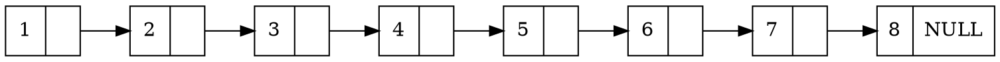
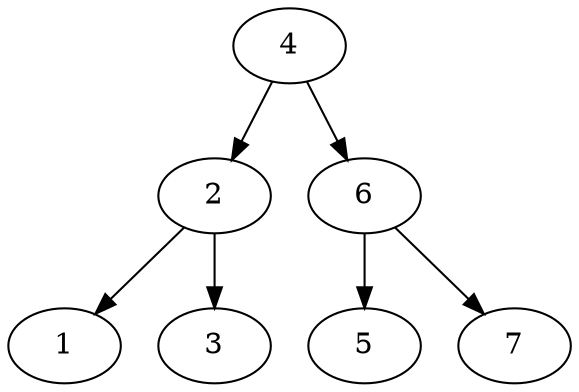
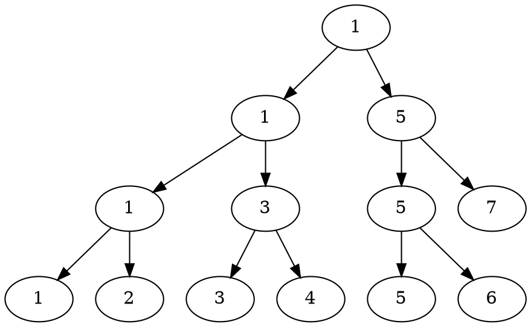

[TOC]

> 基于 [Redis 6.2.1](https://github.com/redis/redis/tree/6.2.1)
>
> 参考资料：
>
> [https://www.jianshu.com/p/9d8296562806](https://www.jianshu.com/p/9d8296562806)

# 跳表

跳表（skiplist）是一种有序的数据结构，它通过在每个节点中维护多个指向其他节点的指针，从而达到快速访问的目的。

跳跃表支持平均$O(log N)$, 最坏$O(N)$复杂度的节点查找，还可以通过顺序性操作来批量处理节点。

## 跳表的数据结构

跳表既然是叫什么什么表，那么本质上还是链表。

对于一个单链表只能依次遍历，但跳表存储的是有序的节点。

众所周知，利用有序这个单调性是可以二分的，因此可以优化查找操作。二分需要不断的折半，也就是找当前操作区间的正中间的元素，递归下去直到这个区间长度变为1。其实二叉查找树（BST，Binary Search Tree）就是这么玩儿的。像下图这样：

这里看起来链表和二叉树差别很大，链表相当于只能存二叉树叶子结点的内容，对于非叶子结点无能为力了。

但办法还是有的，上图是一个无重复结点的二叉查找树。稍微换个样子就可以了。如下图：

当该二叉查找树维护的序列只在叶子时就差不多一样了。

跳表结构和该二叉查找树一样采用冗余节点存储二分查找中间值的时候，就能够实现$O(log N)$的查找效率了。

现在可以看下跳表的真正模样了。

## 跳表的增删改查

## 跳表的优势

# Redis 中跳表的实现
