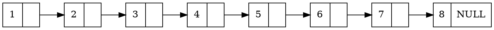
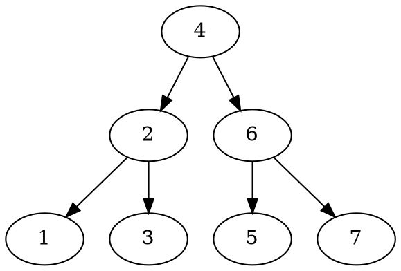
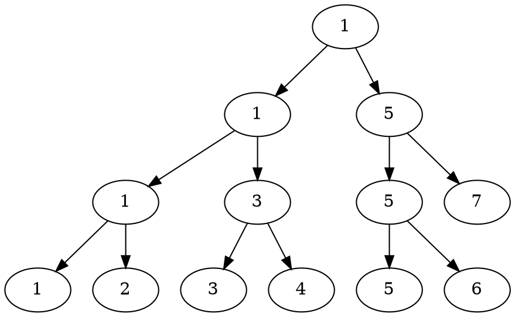

[TOC]

> 基于 [Redis 6.2.1](https://github.com/redis/redis/tree/6.2.1)
>
> 参考资料：
>
> [https://www.jianshu.com/p/9d8296562806](https://www.jianshu.com/p/9d8296562806)
>
> *画图工具是真的难用啊*， 找不到好用的工具。。。

# 跳表

跳表（skiplist）是一种有序的数据结构，它通过在每个节点中维护多个指向其他节点的指针，从而达到快速访问的目的。

跳跃表支持平均$O(log N)$, 最坏$O(N)$复杂度的节点查找，还可以通过顺序性操作来批量处理节点。

## 跳表的数据结构

跳表既然是叫什么什么表，那么本质上还是链表。下面先看一下普通单链表的结构：


<details><summary>图片graphviz源码 展开/收起</summary>

</details>

对于一个单链表只能依次遍历，但跳表存储的是有序的节点。

众所周知，利用有序这个单调性是可以二分的，因此可以优化查找操作。二分需要不断的折半，也就是找当前操作区间的正中间的元素，递归下去直到这个区间长度变为1。其实二叉查找树（BST，Binary Search Tree）就是这么玩儿的。像下图这样：


<details><summary>图片graphviz源码 展开/收起</summary>

</details>
这里看起来链表和二叉树差别很大，链表相当于只能存二叉树叶子结点的内容，对于非叶子结点无能为力了。

但办法还是有的，上图是一个无重复结点的二叉查找树。稍微换个样子就可以了。如下图：


<details><summary>图片graphviz源码 展开/收起</summary>

</details>
当该二叉查找树维护的序列只在叶子时就差不多一样了。

跳表结构和该二叉查找树一样采用冗余节点存储二分查找中间值的时候，就能够实现$O(log N)$的查找效率了。

现在可以看下跳表的真正模样了。

<details><summary>图片graphviz源码 展开/收起</summary>

</details>


## 跳表的增删改查


## 随机函数

```c
/* Returns a random level for the new skiplist node we are going to create.
 * The return value of this function is between 1 and ZSKIPLIST_MAXLEVEL
 * (both inclusive), with a powerlaw-alike distribution where higher
 * levels are less likely to be returned. */
int zslRandomLevel(void) {
    int level = 1;
    while ((random()&0xFFFF) < (ZSKIPLIST_P * 0xFFFF))
        level += 1;
    return (level<ZSKIPLIST_MAXLEVEL) ? level : ZSKIPLIST_MAXLEVEL;
}
```


## 跳表的优势

# Redis 中跳表的实现

跳表节点在 `server.h` 文件中:

```c
typedef struct zskiplistNode {
    sds ele;
    double score;
    struct zskiplistNode *backward;
    struct zskiplistLevel {
        struct zskiplistNode *forward;
        unsigned long span;
    } level[];
} zskiplistNode;
```

-   `ele` 元素的值，采用`sds` 类型。（老版本这里用的`robj`，后面统一改成了`sds`）
-   `score` 分数，浮点型
-   `*backward` 后退指针，从表尾向前遍历，这里只能一个一个遍历。
-   `zskiplistLevel` 跳表层级
    -   `*forward` 前进指针，它指向的下一个节点。
    -   `span` 跨度， 到它指向的下一个节点的距离。

跳表结构体：

```c
typedef struct zskiplist {
    struct zskiplistNode *header, *tail;
    unsigned long length;
    int level;
} zskiplist;
```

-   `*header` 跳表头节点。
-   `*tail` 跳表尾节点。
-   `length` 跳表的节点数量
-   `level` 最大节点的层级数。

>   看到这里又个疑惑，`Redis` 用跳表实现的`Sorted Set` , 那么 `ZSCORE` 命令啥的查找岂不是要$O(N)$了？
>
>   到了后面看代码才知道，每个`Redis` 的上层数据类型（`String`, `Hash`, `Set`, `List`,`Sorted Set`）等的实现都是多个底层数据结构复合而成的，比如`Sorted Set`在数量多了的时候就是用了`skiplist`和`dict`一起实现的。
>
>   ```c
>   typedef struct zset {
>       dict *dict;
>       zskiplist *zsl;
>   } zset;
>   ```
